# Tic-Tac-Toe Python Game

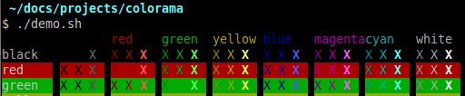

Tic-tac-toe is a digital game for two players. The game is played on a grid that consists of three rows and three columns. Your symbol is X, and the computer's symbol is O. Each player takes turn allocating their symbol to an empty space on the grid. The first player to get a row or column consisting of their symbol wins. It is possible to win the game by having their symbol appear up, down or diagonally across the grid wins the round. Once a player has won, the game will automatically restart and move onto the next round. The overall score is constantly recorded, aswell as the total rounds played. This means a player can play for hours and keep track of the score.

## Table Of Contents 

1. UX
2. Features
3. Technologies Used
4. Testing
5. Deployment
6. Credits and Contact

# UX (User Experience)
 ## The target audience for Tic-Tac-Toe are:
 - Younger children who are bored.
 - Older teens who may need a break from work/studying.
 - Older adults who are looking to kill time.

 ## User goals are :
 - Gives users a fun way to take a break from study/work while keeping their brain stimulated.
 - Gives users a fun game to play when they are travelling/ on long journeys
 - Allows users to strategise and play against the computer when alone.

 ## Tic-Tac-Toe reaches the user goals by:
 - Providing a mentally stimulating game.
 - Has no score limit, so a player can play for as long as they want.

 ### Styling:
 - I wanted to make the visual style of this game as simple and as minimalistic as possible. When you run the game. The rules of the game are displayed along with the number of rounds played(starting at 0), and the players allocated symbol(X).
 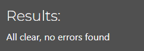

 - Underneath the rules display, lies the 3x3 grid in which the game is played. Each square is clearly seperated from another.
 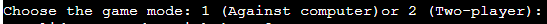

- Below the grid, there lies text which prompts the user to pick a number between 1 and 9, with each number corresponding to a sqaure on the 3x3 grid. 
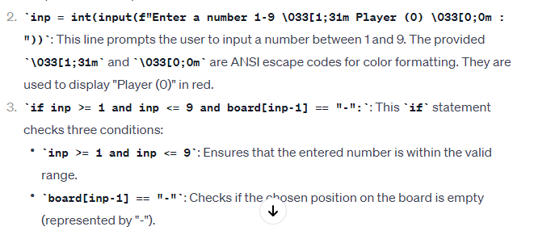

### Colours
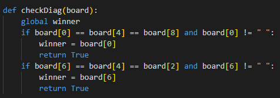

- I installed colorama and used red and green to give the game a bit of life. The grid is in white to contrast with the black background. The rules of the game along with the number of rounds played is displayed in red, this is to catch the users attention and make them aware of the rules before they play. The text to promp the user to choose a number between 1-9 is displayed in green. Red text will display again if the number the player chose is nit valid.
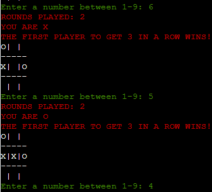

# Features 
 
## Inputs

- I used an input attribute to promp the user to choose a number between 1-9. The code used is shown below. 

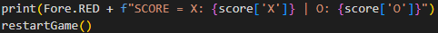

## Try / Except Blocks

- I used try/except blocks in my code to ensure the player chooses a valid number between 1-9 that is also empty on the board. If not, red text will appear and input element will appear again. If the player chooses a letter instead of an integer. Another error message will apear 

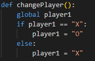

## Dictionaries 

- I used a dictionary in my code to keep track of the score. After each round, the score will update.

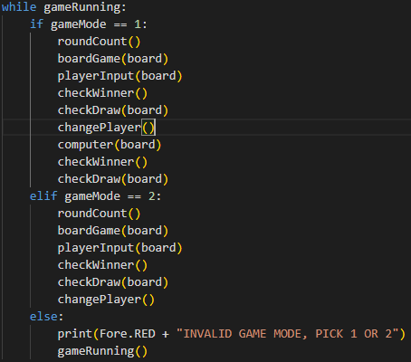

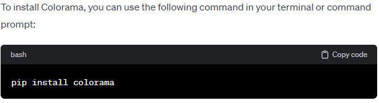

## If/Else statements

- I used if/else blocks in my code to ensure the game ran smooth. 
- An if/else block was implemeted to enable the user to have a different symbol to the computer.
- The player is always X, and the computer is always O.

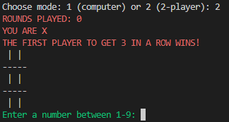

## While loops

- At the end of my python code, I used a while loop in order to make the game run and to allow each function to work in chronological order.

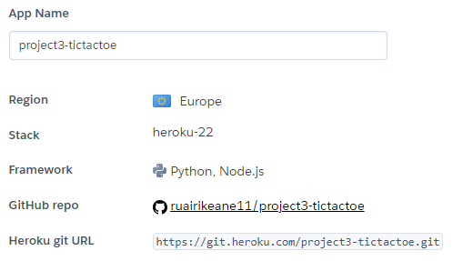

 # Technologies Used

 ## Languages 
 
 - Python

 ## Libraries 

 - I imported random so the computer allocates a symbol to a completely random place on the grid. This ensures the game has a good flow and it makes every round different

 - I used colorama to incorporate color within the game. This ultimately gives the game a form of life and keeps the player engaged with the game.
 
 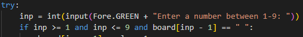

 ## Platforms 

 - I used Github for storing code remotely and deploying.
 - I used Gitpod IDE throughout the development of this project.

## Other Tools 

- I watched videos on Youtube to use as inspration for my game.

- I used ChatGPT 3.5 to help me fix some errors and debug by code.

# Testing 

## Methods

### Validation 

- The python code was regularly ran through https://www.pythonchecker.com/ to ensure it scored a high percentage

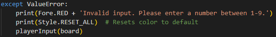

### General Testing

- Throughout the development of this project I constantly ran the game in the terminal to see how the game functioned.

- This meant I could easily try out new methods and change existing code if necessary 

- The repository was sent to friends and family so that they could easily test the game in the terminal and give me feedback.

# Deployment

# Credits

### Youtube

- I used a video (https://www.youtube.com/watch?v=dK6gJw4-NCo) as inspiration for my game design. 
- Specifically, I used the code to make the 3x3 grid appear in the terminal when you run the game.

- I customised my block of code so that is was more complex.

### ChatGPT 3.5

- I used ChatGPT to help me fix bugs. For example, it helped me fix an error to ensure that the score dictionary was updating the correct score.

