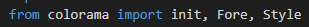
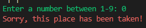
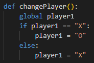
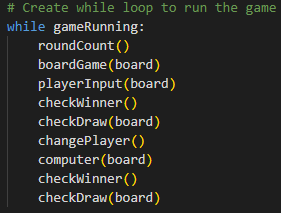
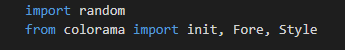

# Tic-Tac-Toe Python 

Tic-Tac-toe is a digital game for one or more players. The game is played on a grid that consists of three rows and three columns. The user has the option to either play against another person or against the computer. Each player takes turn allocating their symbol to an empty space on the grid. The first player to get a row or column consisting of their symbol wins. Once a player has won, the game will automatically restart and move onto the next round. The overall score is constantly recorded, aswell as the total rounds played. This means a player can play for hours and keep track of the score.

## Table Of Contents 

1. UX
2. Features
3. Technologies Used
4. Testing
5. Deployment
6. Credits and Contact

 ## User goals are :

 ## Tic-Tac-Toe reaches the user goals by:

### Colours

- I installed colorama and used red and green to give the game a bit of life. The grid is in white to contrast with the black background. The rules of the game along with the number of rounds played is displayed in red, this is to catch the users attention and make them aware of the rules before they play. The text to promp the user to choose a number between 1-9 is displayed in green. Red text will display again if the number the player chose is nit valid.

# Features 
 
## Inputs

- I used an input attribute to promp the user to choose a number between 1-9. The code used is shown below. 

## Try / Except Blocks

- I used try/except blocks in my code to ensure the player chooses a valid number between 1-9 that is also empty on the board. If not, red text will appear and input element will appear again. If the player chooses a letter instead of an integer. Another error message will apear 

## Dictionaries 

- I used a dictionary in my code to keep track of the score. After each round, the score will update.

## If/Else statements

- I used if/else blocks in my code to ensure the game ran smooth. 
- An if/else block was implemeted to enable the user to have a different symbol to the computer.
- The player is always X, and the computer is always O.

## While loops

- At the end of my python code, I used a while loop in order to make the game run and to allow each function to work in chronological order.

 # Technologies Used

 ## Languages 
 
 - Python

 ## Libraries 

 - I imported random so the computer allocates a symbol to a completely random place on the grid. This ensures the game has a good flow and it makes every round different

 - I used colorama to incorporate color within the game. This ultimately gives the game a form of life and keeps the player engaged with the game.
 
 

 ## Platforms 

 - I used Github for storing code remotely and deploying.
 - I used Gitpod IDE throughout the development of this project.

## Other Tools 

# Testing 

## Methods

### Validation 

### General Testing

- Throughout the development of this project I constantly ran the game in the terminal to see how the game functioned.

- This meant I could easily try out new methods and change existing code if necessary 

- The repository was sent to friends and family so that they could easily test the game in the terminal and give me feedback.

# Deployment

# Credits

