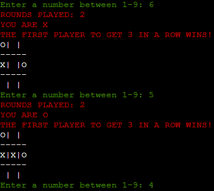

# Tic-Tac-Toe Python 

Tic-Tac-toe is a digital game for one or more players. The game is played on a grid that consists of three rows and three columns. The user has the option to either play against another person or against the computer. Each player takes turn allocating their symbol to an empty space on the grid. The first player to get a row or column consisting of their symbol wins. Once a player has won, the game will automatically restart and move onto the next round. The overall score is constantly recorded, aswell as the total rounds played. This means a player can play for hours and keep track of the score.

## Table Of Contents 

1. UX
2. Features
3. Technologies Used
4. Testing
5. Deployment
6. Credits and Contact

# Uxer Experience

 ## User goals are as follows :
 - Play either a one player/two player game.
 - Win the round by getting a row or column of X/O.
 - Consistently win as many rounds as possible.
 
 ## Tic-Tac-Toe reaches the user goals by:
 - Provides an option of single player and double player for user.
 - Provides a 3x3 grid for users to play on.
 - Keeps track of rounds played.
 - Keeps track of overall score for the users.

### Colours
- I installed colorama and used red and green to give the game a bit of life. The grid is in white to contrast with the black background. The rules of the game along with the number of rounds played is displayed in red, this is to catch the users attention and make them aware of the rules before they play. The text to promp the user to choose a number between 1-9 is displayed in green. Red text will display again if the number the player chose is nit valid.

# Features 
 
## Inputs
- I used an input to ask user if they want to play 1 player or 2 player.
- I used an input attribute to prompt the user to choose a number between 1-9. The code used is shown below. 

## Try / Except Blocks
- I wrapped the inputs mentioned above, in a try/except block in order to validate the data given by the user. If the users inputs data that is not an integer, an error will be raised.

## Dictionaries 
- I used a dictionary in my code to keep track of the score. After each round, the score will update.

## If/Else statements

- I used a simple if/else block to alternate between player X's turn and player O's turn.

## While loops

- At the end of my python code, I used a while loop in order to make the game run and to allow each function to work in chronological order.

 # Technologies Used

 ## Languages 
 
 - Python

 ## Libraries 

 - I imported random so the computer allocates a symbol to a completely random place on the grid. This ensures the game has a good flow and it makes every round different.

 - I used colorama to incorporate color within the game. This ultimately gives the game a form of life and keeps the player engaged with the game.
 

 ## Platforms 

 - I used Github for storing code remotely and deploying.
 - I used Gitpod IDE throughout the development of this project.

## Other Tools 

- I used ChatGBT to help me install colorama in order to incorporate colour.

# Testing 

- I constantly tested my project in the terminal throughout the development. This meant I could easily see highlighted errors in my code.
- I sent the repository to friends to that they could test the game. They also gave me some ideas to implement, for example, adding the option to play against someone other than the computer.
- This idea was only implemented in the final stage if my project, but I felt it added a lot to the user experience.
- I simply added an if/elif block to the gameRunning function. After the if/elif statements I called functions in chronological order to ensure the game flowed how it was intended.

## Methods

### Validation 
- The code was tested through CI Python Linter (https://pep8ci.herokuapp.com) until there was no errors found in the code.

### General Testing

- Throughout the development of this project I constantly ran the game in the terminal to see how the game functioned.

- This meant I could easily try out new methods and change existing code if necessary.

- The repository was sent to friends and family so that they could easily test the game in the terminal and give me feedback.

# Deployment

- This project was manually deployed with Heroku in the later stages of the development.
- This meant I had to deploy the project each time I wanted to update it's functionality.
- It was essential to add a Config Var in the setting in order for deployment.
- I added Python, and Node.js to the frameworks sections.

# Credits

## Love Sandwiches Walkthrough Project - Anna Greaves

- I found the Love Sandwiches walkthrough project very helpful in becoming more familar and comfortable wiritng python code and understanding the logic behind it.

- I also became more familiar with deploying with Heroku thanks to the informative videos in the walkthrough project

